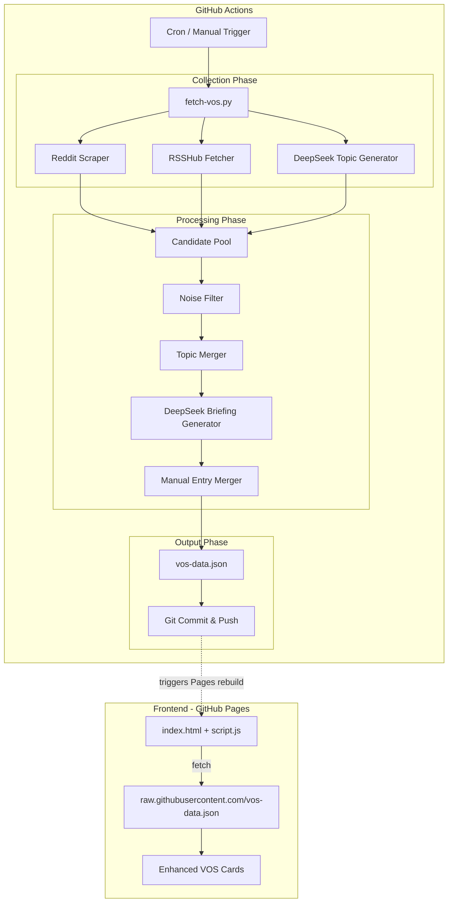
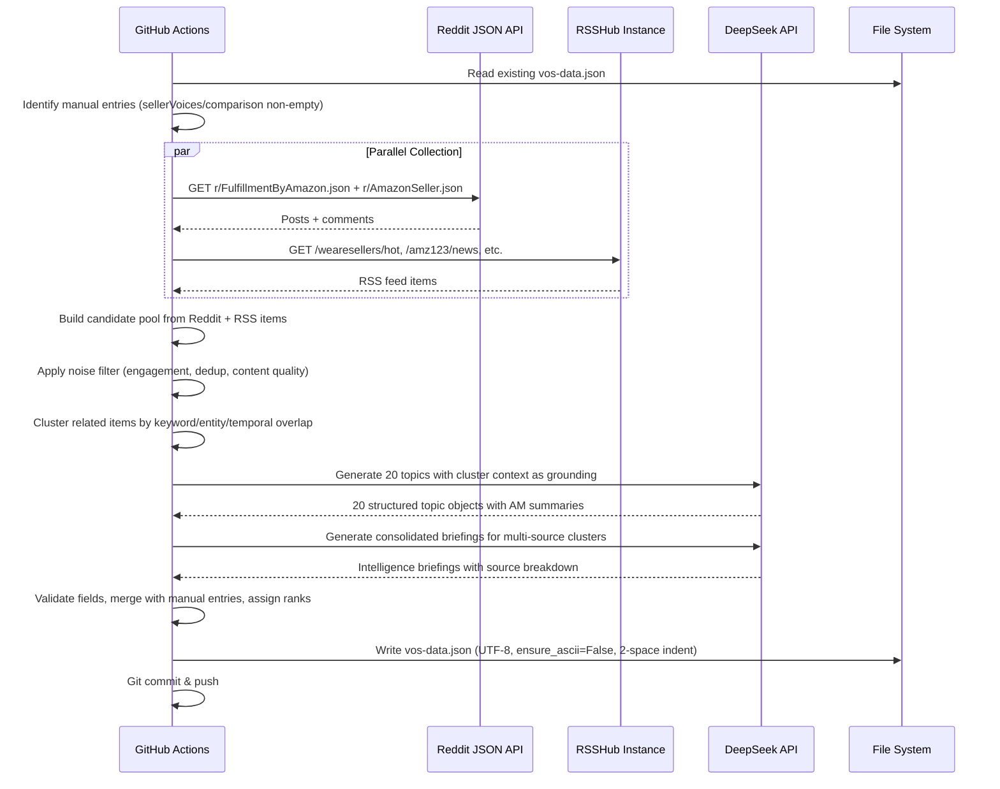

# Design Document: VOS AI Insights

## Overview

The VOS AI Insights feature transforms the existing VOS From Social Media module from a simple RSS-scraping pipeline into a multi-source social media listening system powered by DeepSeek AI. The system collects seller discussions from Reddit, RSSHub-sourced Chinese seller forums, and DeepSeek-generated intelligence, then merges related cross-source discussions into consolidated intelligence briefings for Amazon Account Managers.

The architecture follows a three-phase pipeline pattern:

1. **Collect** — Gather raw items from Reddit JSON API, RSSHub feeds, and DeepSeek API topic generation
2. **Process** — Filter noise, merge cross-source topics, classify by layer/category/sentiment/alert level
3. **Output** — Write enriched `vos-data.json` preserving manual entries, consumed by the static frontend

The pipeline runs as a Python 3.12 script in GitHub Actions on a daily schedule. The frontend remains a static GitHub Pages site that loads the JSON file and renders enhanced VOS cards with intelligence briefing layout, sentiment indicators, layer badges, and source priority badges.

### Key Design Decisions

- **DeepSeek as primary intelligence engine**: Rather than relying solely on RSS scraping (which produces noisy, low-quality title fragments), DeepSeek generates curated topics with AM-perspective summaries. RSS/Reddit data serves as grounding context and cross-verification.
- **RSSHub for Chinese forum access**: Self-hosted or public RSSHub instance provides a uniform RSS interface to platforms like 知无不言, AMZ123, 卖家之家 that lack native RSS feeds.
- **Reddit JSON API (no OAuth)**: GitHub Actions can access Reddit's public JSON API (`{url}.json`) without authentication, avoiding OAuth complexity.
- **Cross-source merging before AI summarization**: Raw items are clustered by topic similarity first, then DeepSeek synthesizes each cluster into a single intelligence briefing — producing higher quality output than summarizing items individually.
- **Manual entry preservation**: Hand-curated entries (with `sellerVoices` or `comparison` data) are treated as immutable across pipeline runs.

## Architecture



### Pipeline Execution Flow



## Components and Interfaces

### 1. Reddit Scraper (`RedditScraper`)

Fetches posts and comments from Amazon seller subreddits using the public JSON API.

```python
class RedditScraper:
    SUBREDDITS = ["FulfillmentByAmazon", "AmazonSeller"]
    CONFIRMATION_WORDS = ["confirmed", "happening to me too", "same here", 
                          "can confirm", "me too", "same issue"]
    
    def fetch_posts(self, subreddit: str, limit: int = 25) -> list[RedditPost]:
        """Fetch top/hot posts from a subreddit via {url}.json API."""
        
    def fetch_comments(self, post_url: str, limit: int = 30) -> list[RedditComment]:
        """Fetch top comments for a post. Only for posts with >10 comments."""
        
    def count_confirmations(self, comments: list[RedditComment]) -> int:
        """Count comments containing confirmation words."""
        
    def extract_seller_voices(self, comments: list[RedditComment], max_voices: int = 3) -> list[SellerVoice]:
        """Extract top-scored comments (score >= 5) as seller voices."""
        
    def scrape_all(self) -> list[RawItem]:
        """Scrape all configured subreddits, apply engagement filter (>=3 comments AND >=5 upvotes)."""
```

### 2. RSSHub Fetcher (`RSSHubFetcher`)

Fetches and parses RSS feeds from RSSHub routes and native RSS sources.

```python
class RSSHubFetcher:
    ROUTES = {
        "知无不言_hot": "/wearesellers/hot",
        "知无不言_new": "/wearesellers/new",
        "AMZ123": "/amz123/news",
        "卖家之家": "/mjzj/article",
        "Amazon_Forums": "/amazon/seller-forums",
        "雨果跨境": "/cifnews/article",
    }
    NATIVE_RSS = {
        "Value Added Resource": "https://www.valueaddedresource.net/feed/",
    }
    TIMEOUT = 15  # seconds per source
    
    def __init__(self, rsshub_base_url: str = "https://rsshub.app"):
        """Initialize with RSSHub instance URL."""
        
    def fetch_feed(self, route_or_url: str) -> list[RawItem]:
        """Fetch and parse a single RSS feed. Returns empty list on failure."""
        
    def fetch_all(self) -> list[RawItem]:
        """Fetch all configured feeds, skipping failures gracefully."""
```

### 3. DeepSeek Client (`DeepSeekClient`)

Handles all interactions with the DeepSeek API including topic generation and briefing synthesis.

```python
class DeepSeekClient:
    MAX_RETRIES = 3
    BACKOFF_DELAYS = [2, 4, 8]  # seconds
    
    def __init__(self, api_key: str):
        """Initialize with API key from DEEPSEEK_API_KEY env var."""
        
    def generate_topics(self, context_items: list[RawItem]) -> list[TopicDict]:
        """Generate 20 curated topics using context items as grounding.
        Prompt instructs: 10 Layer 1 (policy_impact), 5 Layer 2 (macro_event), 5 Layer 3 (emerging_unknown).
        Includes noise filter instructions and AM-perspective summary requirements.
        """
        
    def generate_briefing(self, cluster_items: list[RawItem]) -> BriefingDict:
        """Generate a consolidated intelligence briefing for a multi-source cluster.
        Returns headline, briefing text, source breakdown, and seller consensus.
        """
        
    def _call_api(self, messages: list[dict], retry_count: int = 0) -> dict:
        """Call DeepSeek API with retry logic (exponential backoff: 2s, 4s, 8s).
        On malformed JSON response, retries with simplified prompt.
        """
```

### 4. Noise Filter (`NoiseFilter`)

Filters low-value content from the candidate pool.

```python
class NoiseFilter:
    BEGINNER_KEYWORDS = ["how to start", "how to open", "新手教程", "入门指南", "如何开店", "注册教程"]
    AD_KEYWORDS = ["service provider", "agency", "代运营", "服务商推荐"]
    
    def filter_items(self, items: list[RawItem]) -> list[RawItem]:
        """Apply all noise filters and return clean items."""
        
    def is_beginner_question(self, item: RawItem) -> bool:
        """Check if item is a beginner/how-to-start question."""
        
    def is_service_ad(self, item: RawItem) -> bool:
        """Check if item is a service provider advertisement."""
        
    def deduplicate(self, items: list[RawItem]) -> list[RawItem]:
        """Remove duplicates: if two items share >50% key terms, keep higher engagement one."""
```

### 5. Topic Merger (`TopicMerger`)

Clusters related items from different sources into unified topics.

```python
class TopicMerger:
    KEYWORD_OVERLAP_THRESHOLD = 0.4  # 40% significant term overlap
    TEMPORAL_WINDOW_DAYS = 7
    
    def extract_significant_terms(self, text: str) -> set[str]:
        """Extract nouns, proper nouns, policy names from text."""
        
    def calculate_similarity(self, item_a: RawItem, item_b: RawItem) -> float:
        """Calculate similarity score based on keyword overlap, entity matching, temporal proximity."""
        
    def cluster_items(self, items: list[RawItem]) -> list[Cluster]:
        """Group items into clusters using agglomerative approach."""
        
    def merge_cluster(self, cluster: Cluster, briefing: BriefingDict) -> TopicDict:
        """Merge a cluster into a single topic with cross-source metadata."""
```

### 6. Manual Entry Preserver (`ManualEntryPreserver`)

Handles preservation of hand-curated entries across pipeline runs.

```python
class ManualEntryPreserver:
    def load_existing(self, filepath: str) -> list[TopicDict]:
        """Load existing vos-data.json and return all entries."""
        
    def identify_manual_entries(self, entries: list[TopicDict]) -> list[TopicDict]:
        """Identify entries where sellerVoices or comparison is non-empty."""
        
    def is_duplicate(self, manual_entry: TopicDict, new_topic: TopicDict) -> bool:
        """Check if a new topic covers the same subject as a manual entry (title similarity)."""
        
    def merge(self, manual_entries: list[TopicDict], new_topics: list[TopicDict], max_total: int = 20) -> list[TopicDict]:
        """Merge manual entries with new topics. Manual entries keep original rank positions.
        Deduplicates new topics against manual entries. Fills remaining slots up to max_total.
        """
```

### 7. Pipeline Orchestrator (`VOSPipeline`)

Main entry point that coordinates all components.

```python
class VOSPipeline:
    TOTAL_TOPICS = 20
    EXECUTION_TIMEOUT = 120  # seconds
    
    def __init__(self):
        """Initialize all components. Reads DEEPSEEK_API_KEY from env."""
        
    def run(self) -> None:
        """Execute the full pipeline:
        1. Load existing data, identify manual entries
        2. Collect from Reddit + RSSHub in parallel
        3. Filter noise from candidate pool
        4. Cluster related items
        5. Generate topics via DeepSeek (with cluster context)
        6. Generate briefings for multi-source clusters
        7. Merge with manual entries
        8. Validate, sort by effectDate desc, assign ranks
        9. Write vos-data.json
        """
        
    def validate_topic(self, topic: TopicDict) -> bool:
        """Validate topic has all required fields with correct types/values."""
```

### 8. Frontend Enhancements (`script.js`)

Extensions to existing `renderVOS()` and `filterVOS()` functions.

```javascript
// New rendering elements in renderVOS():
// - AI label: "🤖 AI 生成" badge when aiGenerated === true
// - Layer badge: "📋 政策影响" / "🌍 宏观传导" / "🔍 盲区发现"
// - Sentiment indicator: red/gray/green dot based on sentiment field
// - Alert level: red left border + "⚠️ 紧急" for critical, orange border for high
// - Source priority badge: gold for high-priority, silver for medium-priority
// - Intelligence briefing card: "📊 综合情报 | {N}个来源" header for crossSourceCount >= 2
// - Collapsible source analysis section for briefing cards
// - Confirmation badge: "🔥 {count}人确认" when confirmationCount >= 5
// - Unverified indicator: "⚠️ 待验证" when aiGenerated && no verifiable links
// - Disclaimer banner at top of VOS section

// Enhanced filterVOS():
// - Support filtering by layer in addition to topic category
```

## Data Models

### Topic Object (vos-data.json schema)

```json
{
  "id": "vos_001",
  "rank": 1,
  "title": "亚马逊全球站点3月12日全面执行DD+7资金预留新政",
  "verified": "official",
  "effectDate": "2026-03-12",
  "summary": "该政策统一全球卖家资金预留规则...",
  "source": "亚马逊官方",
  "topic": "compliance",
  "topicLabel": "⚖️ 合规",
  "layer": "policy_impact",
  "layerLabel": "📋 政策影响",
  "sentiment": "negative",
  "painPoints": ["cash flow pressure", "extended payment cycle"],
  "alertLevel": "critical",
  "insightType": "blind_spot",
  "aiGenerated": false,
  "crossSourceCount": 3,
  "confirmationCount": 12,
  "sourceBreakdown": {
    "Reddit r/FBA": "Sellers share workaround strategies for cash flow",
    "知无不言": "Focus on compliance risk and FBM impact",
    "AMZ123": "Detailed policy timeline and before/after analysis"
  },
  "sellerConsensus": "Sellers across platforms unanimously view this as harmful",
  "sellerVoices": [
    { "source": "Reddit (👍42)", "content": "This is devastating for small sellers..." }
  ],
  "comparison": [
    { "dimension": "FBA回款周期", "before": "3-5天", "after": "8-9天" }
  ],
  "links": [
    { "label": "亚马逊帮助中心", "url": "https://sellercentral.amazon.com/help/hub/200380620" }
  ]
}
```

### Field Specifications

| Field | Type | Required | Values / Constraints |
|-------|------|----------|---------------------|
| `id` | string | yes | Format: `vos_XXX` (3-digit zero-padded) |
| `rank` | integer | yes | 1-20 |
| `title` | string | yes | Non-empty |
| `verified` | string | yes | Default: `"unconfirmed"` |
| `effectDate` | string | yes | ISO date format `YYYY-MM-DD` |
| `summary` | string | yes | 100-400 Chinese characters for AI-generated |
| `source` | string | yes | From allowed Source_Platform set |
| `topic` | string | yes | One of: advertising, promotion, compliance, brand, returns, tax, logistics, trending |
| `topicLabel` | string | yes | Emoji + Chinese label matching topic |
| `layer` | string | yes | One of: policy_impact, macro_event, emerging_unknown |
| `layerLabel` | string | yes | "📋 政策影响" / "🌍 宏观传导" / "🔍 盲区发现" |
| `sentiment` | string | yes | One of: negative, neutral, positive |
| `painPoints` | array[string] | yes | 1-3 specific pain points |
| `alertLevel` | string | yes | One of: critical, high, normal |
| `insightType` | string | yes | One of: blind_spot, amplifier, confirmation |
| `aiGenerated` | boolean | yes | true for DeepSeek-generated, false for manual |
| `crossSourceCount` | integer | no | Number of distinct sources (≥2 for briefing cards) |
| `confirmationCount` | integer | no | Reddit confirmation word count |
| `sourceBreakdown` | object | no | Platform → unique angle mapping |
| `sellerConsensus` | string | no | Cross-platform agreement summary |
| `sellerVoices` | array | yes | Default: `[]` |
| `comparison` | array | yes | Default: `[]` |
| `links` | array | yes | Array of `{label, url}` objects. No fabricated URLs. |

### RawItem (internal pipeline model)

```python
@dataclass
class RawItem:
    title: str
    content: str
    source_platform: str  # e.g., "Reddit r/FBA", "知无不言", "AMZ123"
    source_priority: str  # "high", "medium", "low"
    date: str             # ISO date
    url: str              # original URL, empty string if none
    engagement: int       # upvotes, comments, or 0
    confirmation_count: int  # Reddit confirmation words count
    seller_voices: list[dict]  # extracted high-score comments
```

### Cluster (internal pipeline model)

```python
@dataclass
class Cluster:
    items: list[RawItem]
    source_platforms: set[str]  # distinct platforms in cluster
    primary_keywords: set[str]  # shared significant terms
    date_range: tuple[str, str]  # earliest, latest date
```

### Source Priority Mapping

```python
SOURCE_PRIORITY = {
    "high": [
        "Reddit r/FulfillmentByAmazon", "Reddit r/AmazonSeller",
        "知无不言", "AMZ123", "Amazon Seller Central Forums",
        "Value Added Resource"
    ],
    "medium": ["卖家之家", "雨果跨境", "微信公众号"],
    "low": ["行业媒体"]  # fallback
}
```

### Topic Category Mapping

```python
TOPIC_LABELS = {
    "advertising": "📢 广告",
    "promotion": "🏷️ 促销",
    "compliance": "⚖️ 合规",
    "brand": "🏢 品牌",
    "returns": "📦 退货",
    "tax": "💰 税务",
    "logistics": "🚚 物流",
    "trending": "🔥 趋势",
}
```


## Correctness Properties

*A property is a characteristic or behavior that should hold true across all valid executions of a system — essentially, a formal statement about what the system should do. Properties serve as the bridge between human-readable specifications and machine-verifiable correctness guarantees.*

### Property 1: Topic Validation Completeness

*For any* topic dictionary, the validation function SHALL accept it if and only if it contains all required fields (`id`, `rank`, `title`, `verified`, `effectDate`, `summary`, `source`, `topic`, `layer`, `sentiment`, `painPoints`, `alertLevel`, `insightType`, `aiGenerated`, `sellerVoices`, `comparison`, `links`) with correct types and allowed values — `topic` in {advertising, promotion, compliance, brand, returns, tax, logistics, trending}, `layer` in {policy_impact, macro_event, emerging_unknown}, `sentiment` in {negative, neutral, positive}, `alertLevel` in {critical, high, normal}, `insightType` in {blind_spot, amplifier, confirmation}, `painPoints` array length 1-3, and `summary` between 100-400 Chinese characters for AI-generated topics.

**Validates: Requirements 1.5, 2.2, 3.1, 3.2, 8.2, 14.1, 14.2, 15.2, 17.1**

### Property 2: Field Normalization Always Produces Valid Values

*For any* arbitrary string input as category, layer, or source, the normalization/mapping function SHALL always produce a value from the corresponding allowed set — category maps to one of the 8 allowed values (defaulting to "trending"), layer maps to one of the 3 allowed values, and source maps to a valid Source_Platform (defaulting to "行业媒体"). No input can produce an output outside the allowed set.

**Validates: Requirements 3.1, 3.2, 3.3, 4.1, 4.2**

### Property 3: RSS Feed Parsing Extracts All Required Fields

*For any* valid RSS XML document containing `<item>` elements with `<title>`, `<description>`, `<pubDate>`, `<link>`, and `<author>` sub-elements, the RSS parser SHALL extract all five fields into the corresponding RawItem fields without data loss or corruption.

**Validates: Requirements 5.4**

### Property 4: Topic Merging Clusters by Similarity

*For any* set of RawItem objects, if two items share more than 40% keyword overlap on significant terms AND reference the same entity AND are published within 7 days of each other, they SHALL be placed in the same cluster. Furthermore, the resulting cluster's `crossSourceCount` SHALL equal the number of distinct `source_platform` values among its items.

**Validates: Requirements 6.1, 6.2, 6.3**

### Property 5: Noise Filter Correctness

*For any* RawItem, the noise filter SHALL reject it if it matches beginner question patterns, service provider ad patterns, or pure emotional venting patterns. For Reddit posts specifically, the filter SHALL reject posts with fewer than 3 comments AND fewer than 5 upvotes. Items not matching any noise pattern SHALL be preserved.

**Validates: Requirements 7.1, 7.3**

### Property 6: Title Deduplication Keeps Higher Engagement

*For any* pair of RawItem objects whose titles share more than 50% of key terms, the deduplication function SHALL keep exactly one — the item with higher engagement metrics — and discard the other.

**Validates: Requirements 7.4**

### Property 7: Output Sort and Rank Invariant

*For any* list of topic objects output by the pipeline, the topics SHALL be sorted by `effectDate` in descending order (most recent first), and `rank` values SHALL be sequential integers from 1 to N where N is the number of topics.

**Validates: Requirements 8.3**

### Property 8: Manual Entry Preservation

*For any* existing topic where `sellerVoices` is non-empty OR `comparison` is non-empty, the pipeline output SHALL contain that topic with all original fields unchanged, and its `aiGenerated` field SHALL be `false`. Conversely, topics generated by DeepSeek SHALL have `aiGenerated` set to `true`.

**Validates: Requirements 9.1, 9.2, 10.2, 10.3**

### Property 9: Manual Entry Merge Priority

*For any* set of manual entries and new AI-generated topics, the merge function SHALL: (a) always include all manual entries, (b) discard any new topic whose title is similar to a manual entry, (c) fill remaining slots with new topics up to a total of 20, and (d) never exceed 20 total topics.

**Validates: Requirements 9.3, 9.4**

### Property 10: Reddit Confirmation Word Counting

*For any* list of Reddit comments, the `confirmationCount` SHALL equal the number of comments containing at least one confirmation word from the set {"confirmed", "happening to me too", "same here", "can confirm", "me too", "same issue"} (case-insensitive).

**Validates: Requirements 16.3**

### Property 11: Seller Voice Extraction

*For any* list of Reddit comments, the extracted `sellerVoices` SHALL contain at most 3 entries, each with score >= 5, ordered by score descending, and each with source attribution in the format "Reddit (👍{score})".

**Validates: Requirements 16.4**

## Error Handling

### DeepSeek API Failures

| Failure Mode | Handling Strategy |
|---|---|
| Network error / timeout | Retry up to 3 times with exponential backoff (2s, 4s, 8s delays) |
| All retries exhausted | Preserve existing `vos-data.json` unchanged, log warning, exit gracefully |
| Malformed JSON response | Log parsing error, re-request with simplified prompt (fewer instructions, stricter JSON schema) |
| Missing API key | Exit immediately with clear error message and non-zero exit code |

### RSSHub / RSS Feed Failures

| Failure Mode | Handling Strategy |
|---|---|
| Individual feed timeout (>15s) | Skip that source, log warning, continue with remaining sources |
| All feeds fail | Continue pipeline with Reddit + DeepSeek data only |
| Malformed XML | Skip that feed item, log warning |

### Reddit API Failures

| Failure Mode | Handling Strategy |
|---|---|
| 429 Rate Limited | Wait and retry once after 60 seconds |
| Network error | Skip Reddit data, continue with RSSHub + DeepSeek |
| Malformed JSON | Skip that post, log warning |

### Data Integrity

| Failure Mode | Handling Strategy |
|---|---|
| Existing `vos-data.json` missing | Start fresh with empty manual entries list |
| Existing file has invalid JSON | Log error, start fresh with empty manual entries |
| Output validation fails (missing required fields) | Drop invalid topics, proceed with valid ones, log warning |
| Fewer than 20 valid topics after all processing | Output whatever valid topics exist (may be < 20) |

### Pipeline Timeout

The pipeline has a 120-second execution budget. If the budget is exceeded:
- Write whatever data has been collected so far
- Log a timeout warning
- Exit with non-zero code

## Testing Strategy

### Property-Based Tests (using `hypothesis` for Python)

Each correctness property maps to a property-based test with minimum 100 iterations:

| Property | Test File | Generator Strategy |
|---|---|---|
| P1: Topic Validation | `tests/test_validation.py` | Generate random dicts with varying field presence/types/values |
| P2: Field Normalization | `tests/test_normalization.py` | Generate arbitrary strings for category/layer/source inputs |
| P3: RSS Parsing | `tests/test_rss_parser.py` | Generate valid RSS XML with random titles, dates, content |
| P4: Topic Merging | `tests/test_merger.py` | Generate RawItem sets with controlled keyword overlap and dates |
| P5: Noise Filter | `tests/test_noise_filter.py` | Generate items matching/not matching noise patterns |
| P6: Deduplication | `tests/test_dedup.py` | Generate item pairs with varying title similarity and engagement |
| P7: Sort & Rank | `tests/test_sort_rank.py` | Generate topic lists with random dates |
| P8: Manual Preservation | `tests/test_manual_entry.py` | Generate topics with varying sellerVoices/comparison content |
| P9: Merge Priority | `tests/test_merge_priority.py` | Generate manual entries + new topics with varying title similarity |
| P10: Confirmation Counting | `tests/test_reddit.py` | Generate comment lists with varying confirmation word presence |
| P11: Voice Extraction | `tests/test_reddit.py` | Generate comment lists with varying scores |

Configuration:
- Library: `hypothesis` (Python)
- Min iterations: 100 per property (`@settings(max_examples=100)`)
- Tag format: `# Feature: vos-ai-insights, Property {N}: {title}`

### Unit Tests (example-based)

| Area | Test Cases |
|---|---|
| Prompt construction | Verify DeepSeek prompts contain required instructions (layer distribution, AM perspective, noise exclusion, quality benchmark) |
| API key validation | Missing/empty `DEEPSEEK_API_KEY` exits with error |
| Retry logic | Mock API failures, verify 3 retries with correct backoff delays |
| Malformed JSON handling | Mock malformed response, verify re-request with simplified prompt |
| Category diversity | Verify 20 topics cover ≥4 distinct categories |
| Source diversity | Verify ≥3 distinct sources with ≥1 from High and Medium tiers |
| Frontend rendering | Verify AI label, layer badge, sentiment indicator, alert border, disclaimer |

### Integration Tests

| Area | Test Cases |
|---|---|
| Full pipeline (mocked APIs) | End-to-end run with mocked Reddit/RSSHub/DeepSeek, verify output file structure |
| RSSHub timeout handling | Mock slow RSSHub, verify graceful skip |
| Reddit rate limiting | Mock 429 response, verify retry behavior |
| GitHub Actions workflow | Verify YAML has correct triggers, Python version, commit steps |
